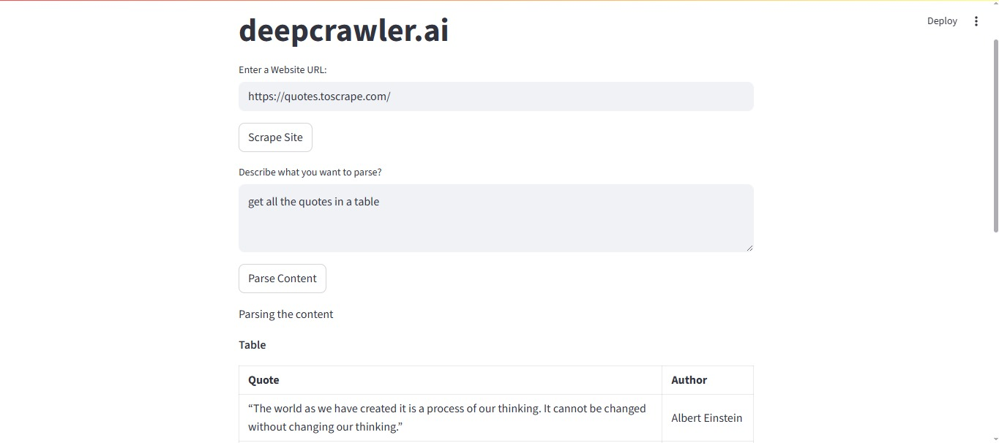

# deepcrawler.ai

> **An intelligent web crawler & parser powered by Streamlit, Selenium, and local LLMs with LangChain + Ollama**

---

## 🚀 Overview

**deepcrawler.ai** is a simple yet powerful web-based application that:

- Scrapes website content using **Selenium + BeautifulSoup**
- Cleans and splits DOM content intelligently
- Uses **LangChain + Ollama** to parse and extract structured data based on user queries
- Is built entirely in **Python with Streamlit**, making it fast, interactive, and easy to deploy

---

## 🎯 Features

✅ Web scraping with headless Chrome (Selenium)  
✅ DOM cleaning and content extraction  
✅ Smart chunking of large pages  
✅ User-prompted content parsing via **local LLMs (Llama3 via Ollama)**  
✅ Streamlit UI for interactive use  
✅ Modular, extensible codebase

---

## 🛠️ Tech Stack

| Tool           | Purpose                         |
|----------------|----------------------------------|
| `Streamlit`    | Web UI                           |
| `Selenium`     | Web scraping                     |
| `BeautifulSoup`| HTML parsing                     |
| `LangChain`    | LLM interface                    |
| `langchain_ollama` | Integration with local Ollama |
| `Ollama`       | Run Llama3 or other LLMs locally |

---

## 📸 Screenshot




---

## 📂 Project Structure

```bash
deepcrawler/
├── main.py           # Streamlit UI
├── scrape.py         # Scraping & cleaning logic
├── parse.py          # LangChain + Ollama parsing
├── requirements.txt  # Python dependencies
└── .env              # Optional: Environment variables
```

---

## 🧪 How It Works

1. **Input a website URL**
2. **Scrape HTML content** using Selenium
3. **Extract & clean** the DOM (body content only)
4. **Split** content into manageable chunks
5. **Describe** what you want to extract (e.g., "Extract all product names and prices")
6. **Ollama + LangChain** processes and parses the data

---

## 🚀 Getting Started

### 📦 1. Install Requirements

```bash
pip install -r requirements.txt
```

### 🧠 2. Run Ollama with your preferred model

```bash
ollama run llama3:8b
```

> Ensure Ollama is running locally at \`http://localhost:11434\` (default)

### ▶️ 3. Launch the App

```bash
streamlit run main.py
```

---

## 🌍 Deployment

You can deploy this app easily on:

- **Render.com** (recommended for full stack apps with Ollama)
- **Localhost** or private servers
- *(Not compatible with Hugging Face Spaces due to Ollama dependency)*

---

## 🔐 Environment Variables

You can optionally set these in a \`.env\` file:

```env
OLLAMA_BASE_URL=http://localhost:11434
```

---

## 💡 Use Cases

- Web data extraction
- AI-powered content parsing
- Open-source RAG (Retrieval-Augmented Generation) backend
- Web audit tools
- SEO or eCommerce scrapers

---

## 🤝 Contributing

Pull requests, feedback, and ideas are welcome!  
Let’s build the most powerful web crawler with AI together.

---

## 📄 License

MIT License – do whatever you want, but please credit the project if it helps you!

---

## 🙋‍♂️ Author

**aranyaadheu**  
📍 Sylhet, Bangladesh  
🌐 [Portfolio](https://aranyaadheu.vercel.app) | 🐙 [GitHub](https://github.com/aranyaadheu)
